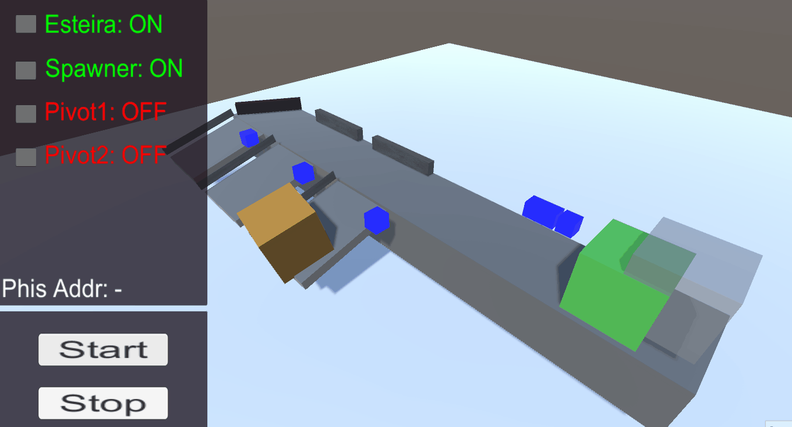

# TCC_Virtual_Env
Repositório dos códigos-fonte utilizados no trabalho de conclusão de curso sobre a utilização da Unity como plataforma de desenvolvimento de um ambiente virtual para o ensino de CLPs

Cena 1 - Sorter

